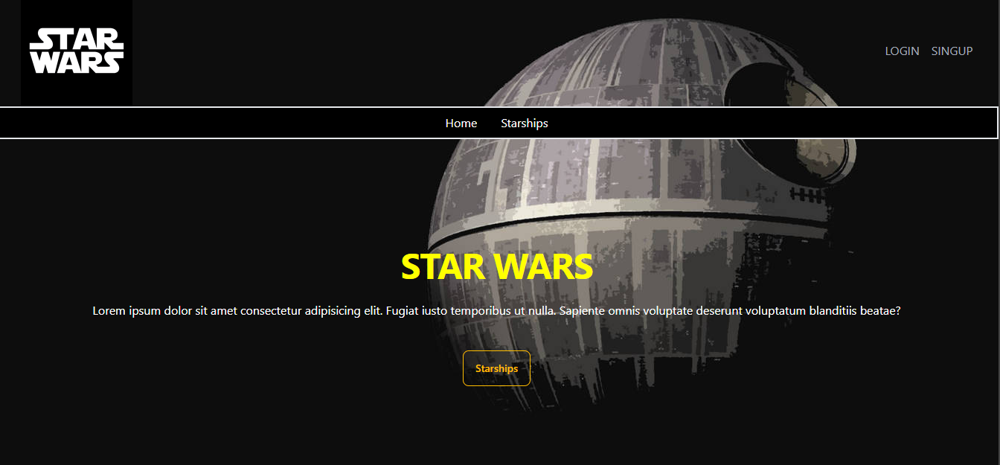
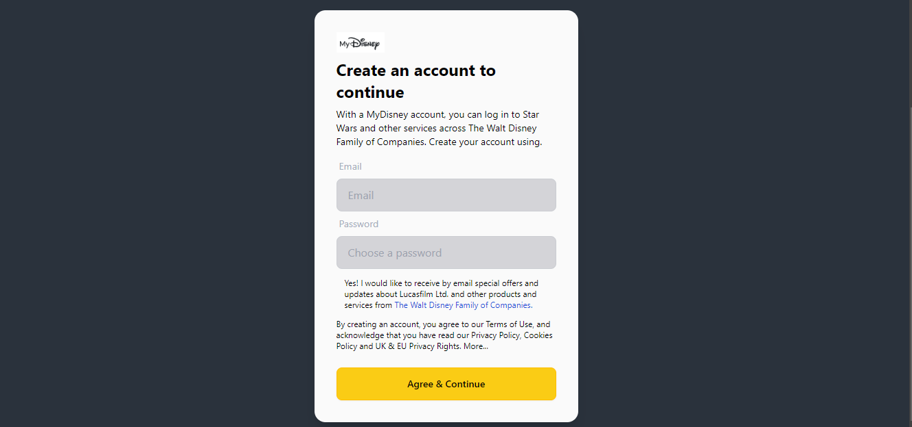
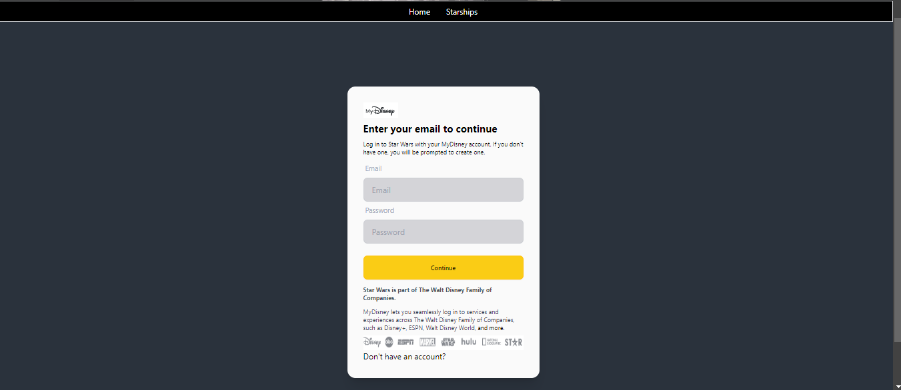
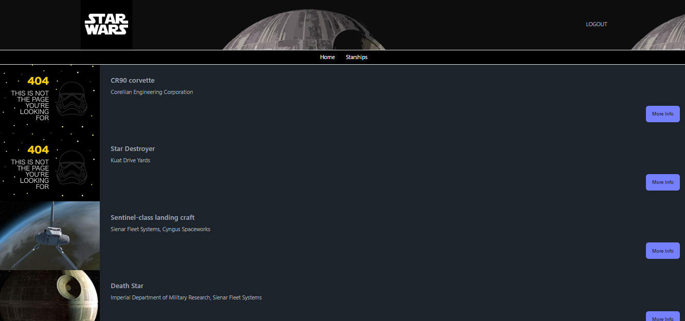
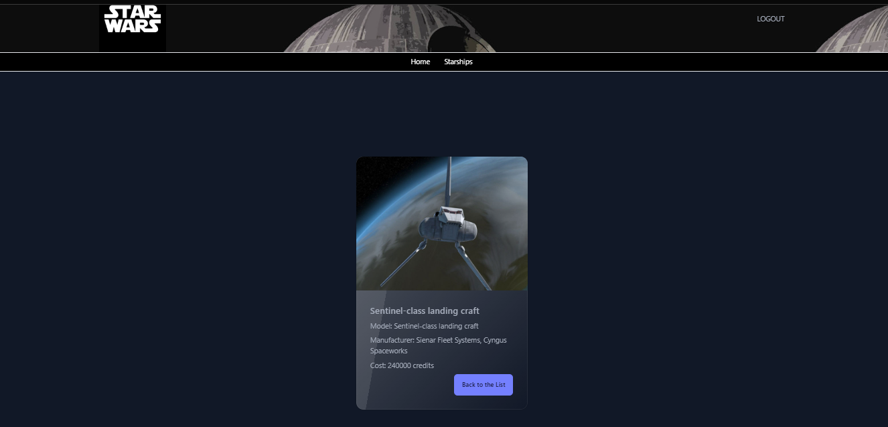
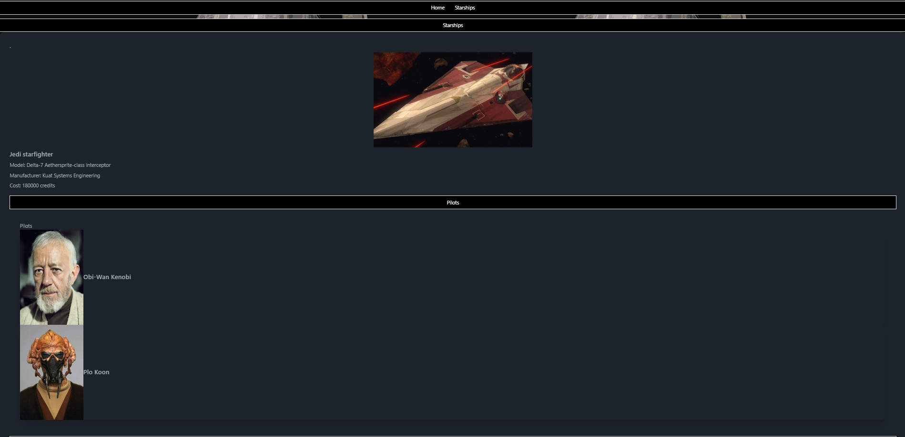

# Star Wars App

## Descripción

Esta aplicación de Star Wars permite a los usuarios registrarse, iniciar sesión y explorar las naves espaciales del universo de Star Wars. Las rutas protegidas aseguran que solo los usuarios autenticados puedan acceder a ciertas partes de la aplicación.

## Características

- Registro de usuario
- Inicio de sesión de usuario
- Protección de rutas con autenticación
- Exploración de naves espaciales
- Detalles de naves espaciales

## Tecnologías Utilizadas

- React
- Firebase (Autenticación y Firestore)
- React Router
- Redux (para manejo del estado)

## Instalación

1. Clona este repositorio:
   ```sh
   https://github.com/LucasFeli/Sprint7.git
   ```

2. Navega al directorio del proyecto:

   - cd Sprint7

3. Instala las dependencias:
    ```sh
    - npm install
    ```

##  Configuracion de Firebase

1. Ve a Firebase Console y crea un nuevo proyecto.
2. Agrega una nueva aplicación web al proyecto y copia la configuración de Firebase.
3. Crea un archivo firebaseConfig.js en el directorio src/firebase y pega tu configuración de Firebase:


```js
import { initializeApp } from "firebase/app";
import { getAuth } from "firebase/auth";
import { getFirestore } from "firebase/firestore";

const firebaseConfig = {
  apiKey: "TU_API_KEY",
  authDomain: "TU_AUTH_DOMAIN",
  projectId: "TU_PROJECT_ID",
  storageBucket: "TU_STORAGE_BUCKET",
  messagingSenderId: "TU_MESSAGING_SENDER_ID",
  appId: "TU_APP_ID"
};

const app = initializeApp(firebaseConfig);
export const auth = getAuth(app);
export const db = getFirestore(app);
export default app;
```

<br>


## Uso 

Para iniciar la aplicación en modo de desarrollo:

```sh
npm start
```

- La aplicación estará disponible en http://localhost:5173.

## Estructura del Proyecto

src/<br>
├── api/                                              # Configuración de la API <br>
│ └── shipsApi.jsx<br>
├── assets/                                           # Imágenes y recursos estáticos<br>
├── components/                                       # Componentes de React<br>
│ ├── Firebase.js <br>
│ ├── Login.jsx <br>
│ ├── Movies.jsx <br>
│ ├── Navbar.jsx <br>
│ ├── Navigation.jsx <br>
│ ├── Pagination.jsx <br>
│ ├── Pilots.jsx <br>
│ ├── PrivateRoute.jsx <br>
│ ├── Register.jsx <br>
│ ├── Starship.jsx <br>
│ └── StarshipDetails.jsx <br>
├── context/                                        # Contextos de React <br>
│ └── AuthContext.js <br>
├── features/ # Configuración de Redux slices <br>
│ └── starshipsSlice.jsx <br>
├── pages/                                         # Configuración de páginas de la aplicación <br>
│ ├── IntroPage/ <br>
│ │ └── IntroPage.jsx <br>
│ 
│ 
│ │ └──  <br>
│ └── starships/ <br>
│ └── StarshipsView.jsx <br>
├── store/ # Configuración de Redux <br>
│ └── store.js <br>
├── App.css # Estilos <br>
├── App.jsx # Componente principal de la aplicación <br>
├── index.css # Estilos globales <br>
└── index.js # Punto de entrada de React <br>

# Rutas


"/" - Página de introducción <br>
"/register "- Página de registro de usuario <br>
"/login" - Página de inicio de sesión de usuario <br>
"/starships" - Página de exploración de naves espaciales (ruta protegida) <br>
"/starships/:id "- Página de detalles de una nave espacial específica (ruta protegida)<br>

- Pagina de introduccion



- Formulario de Registro


- Formulario de Inicio de sesion


- Pagina de exploracion de naves espaciales


- Pagina de detalles de una nave espacial específica



- Pagina de detalles de una nave espacial específica , con sus pilotos y peliculas donde aparecen.



# Contribución

Las contribuciones son bienvenidas. Por favor, abre un issue o un pull request para cualquier mejora o corrección.


